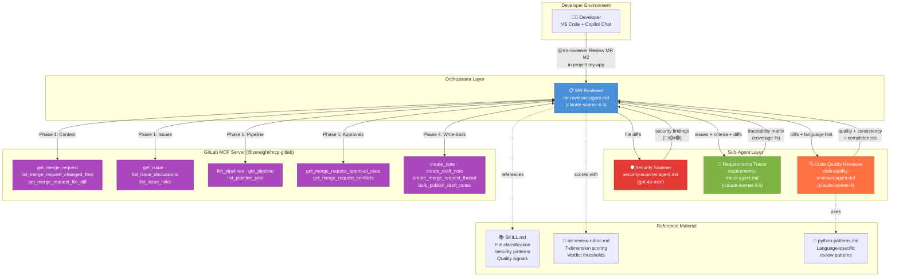
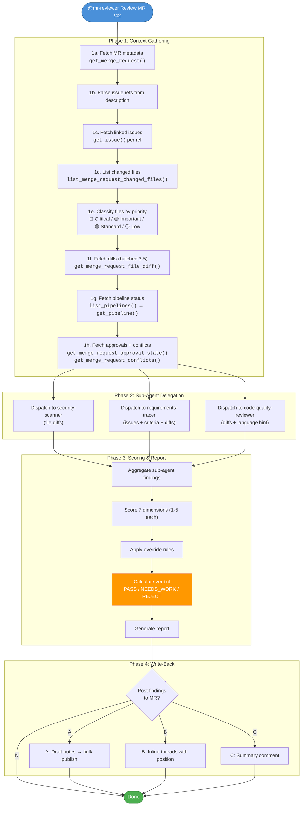
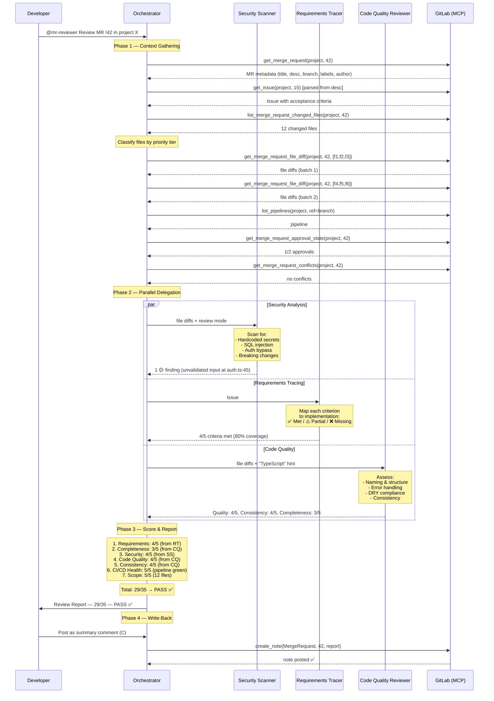
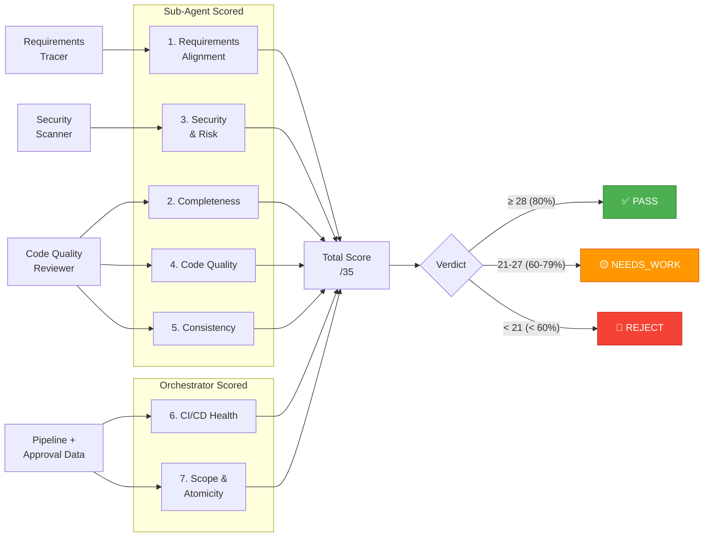
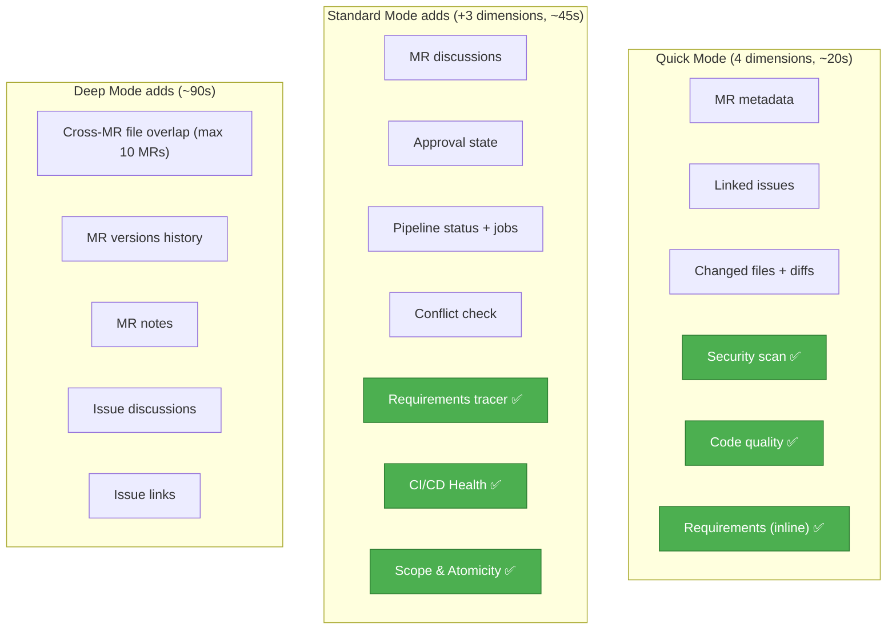
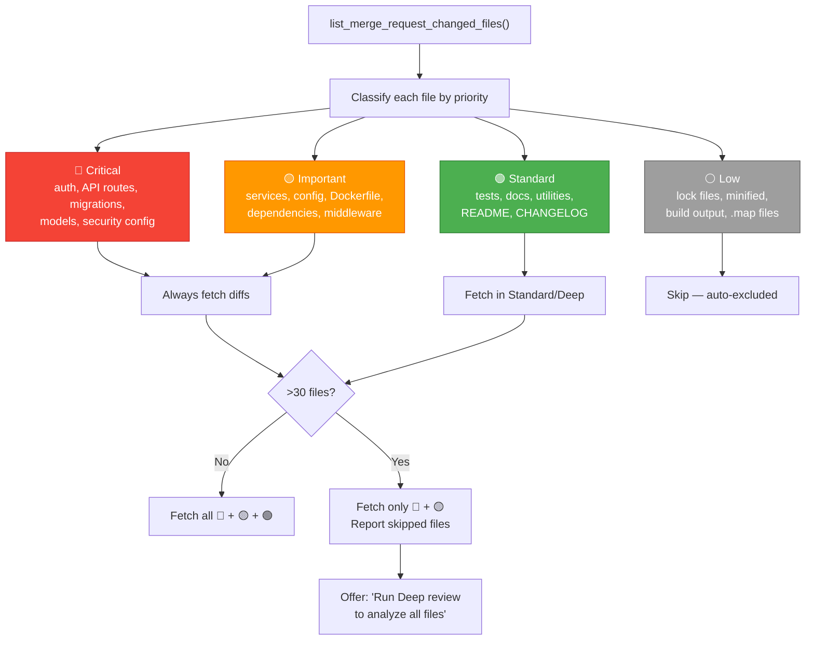
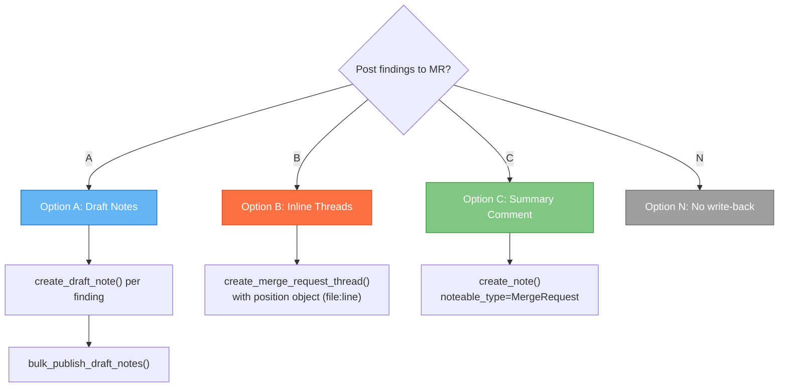
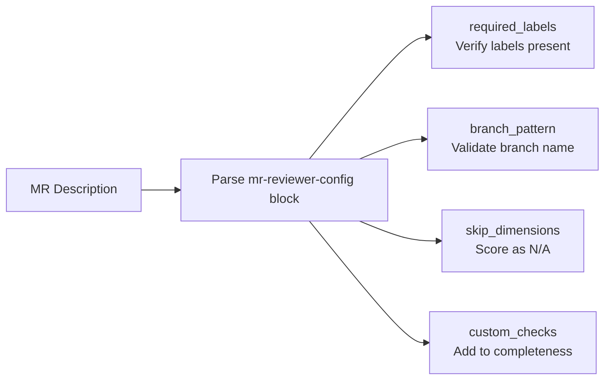
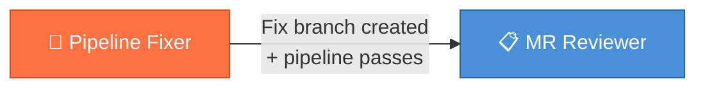

# MR Reviewer Agent — How It Works

> **Version**: 3.0.0
>
> This document explains the architecture, workflow, and scoring mechanisms of the MR Reviewer agent — an AI-powered merge request reviewer that integrates GitLab with GitHub Copilot via MCP.

---

## Overview

The MR Reviewer is an **orchestrator agent** that coordinates three specialist sub-agents to produce a comprehensive, scored merge request review. It operates in three depth modes:

| Mode | Dimensions | Max Score | Data Fetched | Duration |
|------|-----------|-----------|--------------|----------|
| **Quick** | 4 | /20 | MR metadata + diffs + issues | ~20s |
| **Standard** | 7 | /35 | + discussions, pipeline, approvals, conflicts | ~45s |
| **Deep** | 7 | /35 | + cross-MR overlap, MR versions, notes, issue discussions | ~90s |

---

## Architecture



### Key Design Decisions

| Decision | Rationale |
|----------|-----------|
| **Orchestrator makes all MCP calls** | Sub-agents have `tools: []` — they receive only the data they need, never access GitLab directly. |
| **gpt-4o-mini for security scanning** | Security pattern matching is rule-based — fast and cheap is sufficient. |
| **claude-sonnet-4.6 for requirements tracing** | Mapping acceptance criteria to code changes requires strong reasoning. |
| **claude-sonnet-4 for code quality** | Quality assessment benefits from understanding code structure and idioms. |
| **7 scoring dimensions** | Covers the full spectrum from requirements to CI health, enabling objective verdicts. |

---

## Workflow — Phase by Phase



---

## Sub-Agent Communication

The orchestrator passes raw GitLab data to each sub-agent and receives structured findings. Sub-agents never talk to each other or to GitLab directly.



---

## Scoring System

### 7 Dimensions



### Scoring Scale (per dimension)

| Score | Meaning |
|-------|---------|
| **5** | Excellent — no concerns |
| **4** | Good — minor improvements possible |
| **3** | Acceptable — some gaps |
| **2** | Below standard — needs attention |
| **1** | Poor — significant rework needed |
| **N/A** | Cannot assess — dimension removed from total |

### Verdicts

| Mode | Pass (≥80%) | Needs Work (60-79%) | Reject (<60%) |
|------|-------------|---------------------|----------------|
| **Quick** (/20) | ≥ 16 | 12-15 | < 12 |
| **Standard/Deep** (/35) | ≥ 28 | 21-27 | < 21 |

### Dynamic N/A Adjustment

When a dimension is scored N/A (e.g., no linked issues → Requirements = N/A), it is removed from the total and thresholds recalculate:

```
adjusted_max = scored_dimensions × 5
Pass ≥ ceiling(adjusted_max × 0.80)
Needs Work ≥ ceiling(adjusted_max × 0.60)
Reject < ceiling(adjusted_max × 0.60)
```

*Example: 2 dims N/A → 5 scored → max = 25. Pass ≥ 20, Needs Work 15-19, Reject < 15.*

### Override Rules

These take precedence over raw scores:

| Condition | Override |
|-----------|----------|
| Pipeline failing on build/test | Max verdict = **NEEDS_WORK** |
| Any 🔴 Critical security finding | Max verdict = **NEEDS_WORK** |
| No linked issues | Requirements = N/A (adjust total) |
| Unresolved blocking threads | Noted in report |

---

## Depth Modes — What Each Fetches



### Sub-Agent Delegation by Mode

| Sub-Agent | Quick | Standard | Deep |
|-----------|-------|----------|------|
| **Security Scanner** | ✅ | ✅ | ✅ |
| **Requirements Tracer** | ❌ (inline check) | ✅ | ✅ |
| **Code Quality Reviewer** | ✅ | ✅ | ✅ |

In Quick mode, the orchestrator performs a lightweight requirements check itself instead of invoking the requirements-tracer sub-agent.

---

## Adaptive Diff Loading

For large MRs, the orchestrator uses a priority-based diff loading strategy:



---

## Write-Back Options

After presenting the review, the orchestrator asks before writing anything to GitLab:

> "Post findings to MR? (A) Draft notes → bulk publish, (B) Inline threads, (C) Summary comment, (N) No"



**Write-back is never automatic.** The orchestrator always asks for explicit user confirmation before posting anything to GitLab.

---

## Team Overrides

Teams can customise the review by embedding a config block in the MR description:

```markdown
<!-- mr-reviewer-config
required_labels: ["reviewed", "approved"]
branch_pattern: "^(feature|bugfix|hotfix)/"
skip_dimensions: ["Consistency"]
custom_checks:
  - "Verify CHANGELOG.md is updated"
  - "Check that new API endpoints have OpenAPI specs"
-->
```



---

## Error Handling

| Scenario | Behaviour |
|----------|-----------|
| **Transient MCP error** (timeout, 5xx) | Retry once |
| **Persistent MCP failure** (2 consecutive) | Mark affected dimension as "Unable to assess" |
| **Auth error** (401/403) | Stop review. Report auth failure. |
| **Sub-agent timeout** | Use findings from completed sub-agents. Mark failed dimensions. |
| **Diff too large** (>500 lines/file) | Flag for manual review, note in report |
| **MR with 0 files** | Skip code analysis dimensions |
| **Rate limited** | Report partial results, offer re-run |

---

## Cross-Agent Connection

The MR Reviewer connects to the Pipeline Fixer in one direction:



When the Pipeline Fixer creates a `fix/ci-*` branch and the pipeline passes, it suggests running `@mr-reviewer Quick review MR !<iid>` to review the fix before merging.

---

## File Map

```
sdlc-toolkit/
├── .github/
│   ├── agents/
│   │   ├── mr-reviewer.agent.md           ← Orchestrator (you invoke this)
│   │   ├── security-scanner.agent.md       ← Sub-agent (security analysis)
│   │   ├── requirements-tracer.agent.md    ← Sub-agent (requirements mapping)
│   │   └── code-quality-reviewer.agent.md  ← Sub-agent (quality + consistency)
│   └── skills/
│       └── mr-review-workflow/
│           ├── SKILL.md                    ← File classification, security patterns
│           └── python-patterns.md          ← Python-specific review patterns
└── prompt-templates/
    └── mr-review-rubric.md                 ← 7-dimension scoring rubric
```
