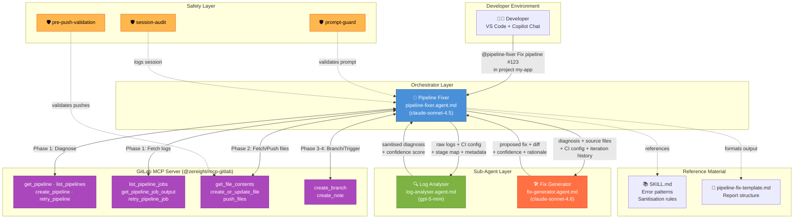
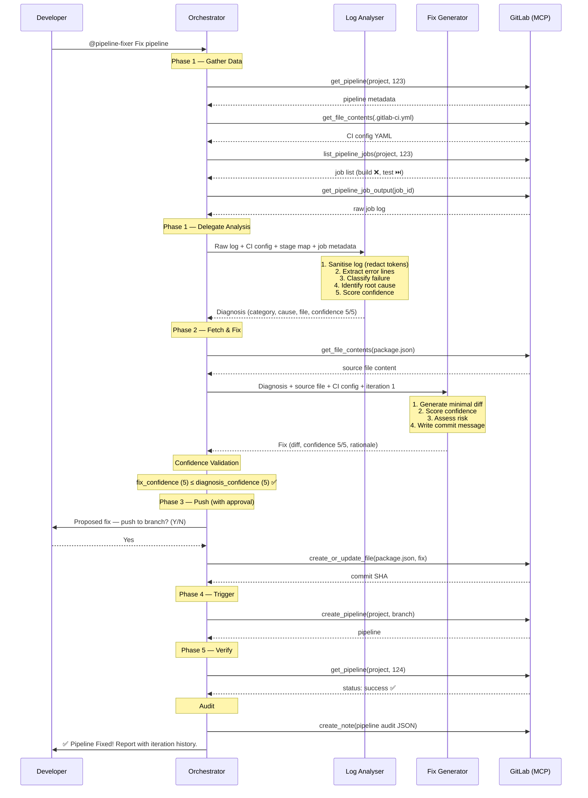
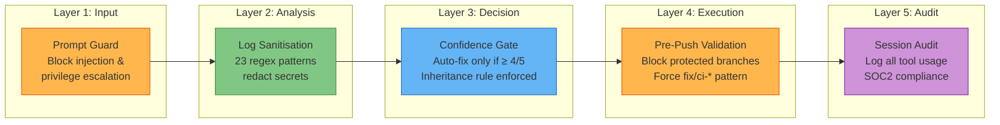
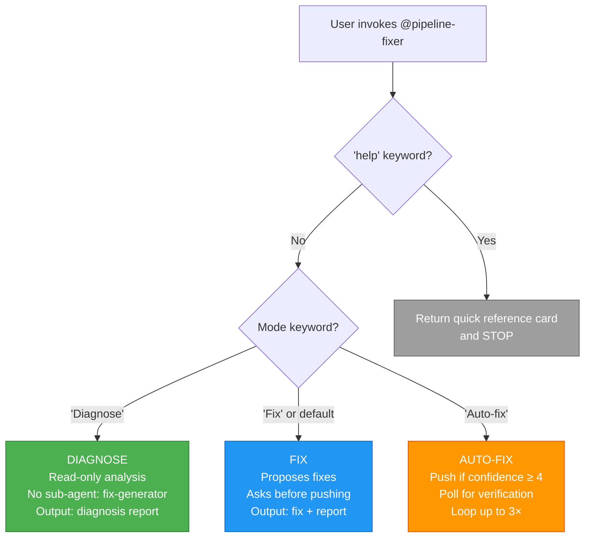
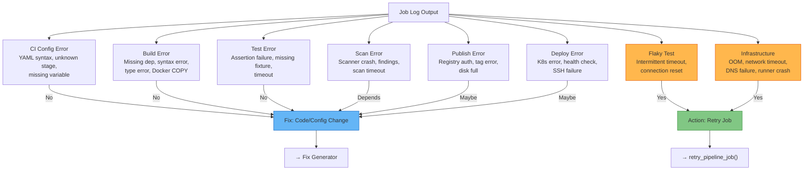
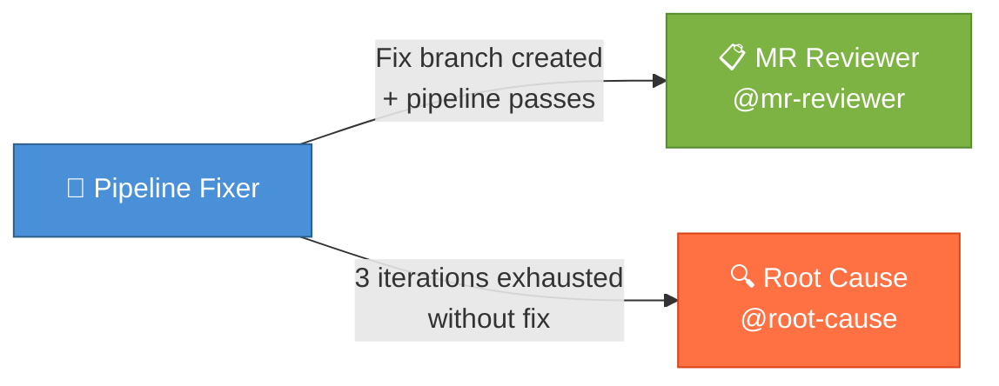

# Pipeline Fixer Agent — How It Works

> **Version**: 3.1.0
>
> This document explains the architecture, workflow, and safety mechanisms of the Pipeline Fixer agent — an AI-powered CI/CD pipeline debugger that integrates GitLab with GitHub Copilot via MCP.

---

## Overview

The Pipeline Fixer is an **orchestrator agent** that coordinates two specialist sub-agents to diagnose and fix CI/CD pipeline failures. It operates in three modes with increasing autonomy:

| Mode | Reads | Writes | Approval |
|------|-------|--------|----------|
| **Diagnose** | ✅ | ❌ | None needed |
| **Fix** | ✅ | ✅ | Asks before every push |
| **Auto-fix** | ✅ | ✅ | Automatic if confidence ≥ 4/5 |

---

## Architecture



### Key Design Decisions

| Decision | Rationale |
|----------|-----------|
| **Orchestrator makes all MCP calls** | Sub-agents have `tools: []` — they can't access GitLab directly. This centralises all external I/O in one place for auditability. |
| **gpt-5-mini for log analysis** | Log parsing is pattern matching — fast and cheap is better than powerful. |
| **claude-sonnet-4.6 for fix generation** | Generating correct minimal code fixes requires strong reasoning. |
| **claude-sonnet-4.5 for orchestration** | Coordination needs large context windows and good planning. |

---

## Workflow — Phase by Phase

```mermaid
flowchart TD
    START(["@pipeline-fixer Fix pipeline #123"])
    
    subgraph "Phase 1: DIAGNOSE"
        P1A["1a. Fetch pipeline overview<br/><code>get_pipeline()</code>"]
        P1B["1b. Fetch CI config<br/><code>get_file_contents(.gitlab-ci.yml)</code>"]
        P1C["1c. Fetch included configs<br/><code>get_file_contents()</code> per include"]
        P1D["1d. List all jobs<br/><code>list_pipeline_jobs()</code>"]
        P1E["1e. Fetch failed job logs<br/><code>get_pipeline_job_output()</code>"]
        P1F["1f. Build stage map"]
        P1G["1g. Delegate to log-analyser"]
    end

    subgraph "Phase 2: FIX"
        P2A["2a. Fetch source files<br/>based on diagnosis category"]
        P2B["2b. Delegate to fix-generator"]
        P2C["2c. Validate confidence<br/>(cap at diagnosis level)"]
        P2D["2d. Present fix to user"]
    end

    subgraph "Phase 3: PUSH"
        P3A{"Confidence ≥ 4?"}
        P3B{"Protected<br/>branch?"}
        P3C["Create fix branch<br/><code>create_branch(fix/ci-...)</code>"]
        P3D["Push fix<br/><code>create_or_update_file()</code>"]
        P3E["Ask user:<br/>'Push this fix? (Y/N)'"]
    end

    subgraph "Phase 4: TRIGGER"
        P4A["Trigger new pipeline<br/><code>create_pipeline()</code>"]
    end

    subgraph "Phase 5: VERIFY"
        P5A["Check pipeline status<br/><code>get_pipeline()</code>"]
        P5B{"Status?"}
        P5C["✅ Report success"]
        P5D{"Iteration < 3?"}
        P5E["❌ Report failure<br/>Suggest @root-cause"]
    end

    POST["Post audit note to GitLab"]

    START --> P1A --> P1B --> P1C --> P1D --> P1E --> P1F --> P1G
    P1G --> P2A --> P2B --> P2C --> P2D
    P2D --> P3A

    P3A -->|"Auto-fix mode"| P3B
    P3A -->|"Fix mode"| P3E
    P3E -->|"Yes"| P3B
    P3E -->|"No"| POST

    P3B -->|"Yes"| P3C --> P3D
    P3B -->|"No"| P3D

    P3D --> P4A --> P5A --> P5B

    P5B -->|"success"| P5C --> POST
    P5B -->|"failed"| P5D
    P5B -->|"running"| P5A

    P5D -->|"Yes"| P1A
    P5D -->|"No"| P5E --> POST

    style START fill:#4A90D9,stroke:#2C5F8A,color:#fff
    style P5C fill:#4CAF50,stroke:#2E7D32,color:#fff
    style P5E fill:#F44336,stroke:#C62828,color:#fff
    style P3E fill:#FF9800,stroke:#E65100,color:#fff
```



---

## Sub-Agent Communication

The orchestrator passes structured data to each sub-agent and receives structured results back. Sub-agents never talk to each other directly.



---

## Safety Mechanisms

### Layered Protection



### Safety Rules Summary

| Rule | Mechanism | What It Prevents |
|------|-----------|-----------------|
| **Never push without approval** (Fix mode) | Orchestrator asks "Push? (Y/N)" | Unintended code changes |
| **Confidence gate** (Auto-fix mode) | Falls back to Fix mode if confidence < 4 | Low-confidence auto-pushes |
| **Protected branch detection** | Creates `fix/ci-*` branch | Pushes to main/production |
| **Max 3 iterations** | Hard stop after 3 loops | Infinite fix loops |
| **Log sanitisation** | 23 regex patterns applied before analysis | Credential exposure to AI |
| **Confidence inheritance** | Fix confidence ≤ diagnosis confidence | Over-confident fixes |
| **Pre-push hook** | Blocks pushes to protected branches | Hook-level enforcement |
| **Prompt guard** | Blocks injection and privilege escalation | Prompt attacks |
| **Audit logging** | All sessions and tool usage logged | Non-repudiation |

---

## Invocation Modes — Decision Tree



---

## Error Classification

The log-analyser classifies failures into categories using patterns from SKILL.md:



---

## Cross-Agent Handoffs

The Pipeline Fixer connects to other agents in the toolkit:



**Handoff triggers:**
- **→ MR Reviewer**: When the fixer creates a `fix/ci-*` branch and the pipeline passes, it suggests: _"Run `@mr-reviewer Quick review MR !<iid>` to review the fix before merging."_
- **→ Root Cause**: When 3 iterations fail to fix the pipeline, it suggests: _"Run `@root-cause Analyse pipeline #<id>` for a deeper investigation."_

---

## File Map

```
sdlc-toolkit/
├── .github/
│   ├── agents/
│   │   ├── pipeline-fixer.agent.md    ← Orchestrator (you invoke this)
│   │   ├── log-analyser.agent.md      ← Sub-agent (log parsing)
│   │   └── fix-generator.agent.md     ← Sub-agent (fix generation)
│   ├── skills/
│   │   └── pipeline-fixer/
│   │       └── SKILL.md               ← Error patterns + sanitisation rules
│   └── hooks/
│       ├── pre-push-validation.json   ← Block unsafe pushes
│       ├── prompt-guard.json          ← Block prompt injection
│       └── session-audit.json         ← Compliance logging
├── prompt-templates/
│   └── pipeline-fix-template.md       ← Report output structure
└── tests/
    └── pipeline-fixer/
        ├── README.md                  ← Validation strategy
        └── fixtures/                  ← Golden-path test scenarios
```
